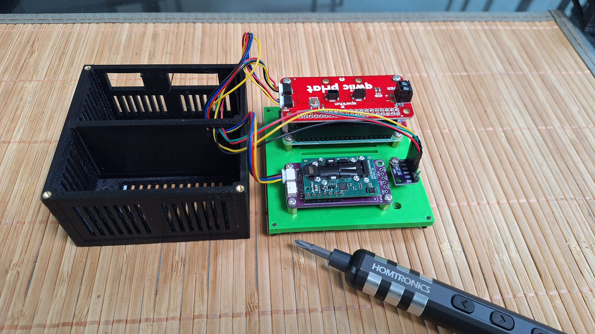

# Moon Rabbit CO2 Sensor

> **You are here:** project overview.
> Jump to: [BOM](BOM.md) · [BUILD](BUILD.md) · [SOFTWARE BUILD](SOFTWARE_BUILD.md) · [CALIBRATION](CALIBRATION.md)
> 
**A Raspberry Pi Zero 2 CO2 and climate monitoring station.**

Moon Rabbit is a low-cost, open-source environmental sensor built around a Raspberry Pi Zero 2. At its core it measures **CO2** (Sensirion SCD30) and **temperature, humidity and pressure** (Bosch BME280). It can be upgraded with more precise temperature/humidity (Sensirion SHT41), air-quality gases VOC and NOx (Sensirion SGP41), sky luminosity (TSL2591), and it is compatible with a range of weather stations — notably the **Davis Vantage Pro** series, **Ambient Weather**, and **Ecowitt**.

It runs as a micro server on your WiFi, giving you 24×7 CO2 and climate indicators through a browser dashboard.

|  |  |
|:---:|:---:|
| Moon Rabbit Sensors | Moon Rabbit Control Panel |

|  | |
|:---:|:---:|
| 3D-printed case with Raspberry Pi Zero 2, Qwiic pHAT, SCD30 and BME280. | |

---

## Documentation

This project is documented across four files. Start with the one that matches what you want to do.

| Document | Description |
|----------|-------------|
| **[BOM.md](BOM.md)** | Bill of materials — every part, bolt and cable you need |
| **[BUILD.md](BUILD.md)** | Physical build — 3D printing, assembly, wiring |
| **[SOFTWARE_BUILD.md](SOFTWARE_BUILD.md)** | Software installation — OS, Python, Supervisor, MQTT, weather-station bridges |
| **[CALIBRATION.md](CALIBRATION.md)** | Sensor calibration and validation (in progress) |

### Typical build sequence

1. Order the parts listed in **[BOM.md](BOM.md)**.
2. Print the case and assemble the hardware per **[BUILD.md](BUILD.md)**.
3. Flash and configure the Pi per **[SOFTWARE_BUILD.md](SOFTWARE_BUILD.md)**.
4. (Optional) Calibrate the CO2 sensor per **[CALIBRATION.md](CALIBRATION.md)**.

---

## Hardware design files

The 3D-printed case is provided as two STL files in the repository root:

- [`MoonRabbitCase_v0.4.stl`](MoonRabbitCase_v0.4.stl) — the base
- [`CarbonSensorStand_v0.9.stl`](CarbonSensorStand_v0.9.stl) — the shell / stand

Print settings and assembly guidance are in **[BUILD.md](BUILD.md)**.

---

## Licence

Software: [MIT](LICENSE) — see the `LICENSE` file.
Hardware design files: [CC BY-SA 4.0](https://creativecommons.org/licenses/by-sa/4.0/).

## Acknowledgements

- Bosch, Sensirion, SparkFun and Adafruit for sensors and open-source libraries
- The [`indi2mqtt`](https://github.com/rkaczorek/indi2mqtt) project for the Vantage Pro bridge
- [`ecowitt2mqtt`](https://github.com/bachya/ecowitt2mqtt) for the Ecowitt / Ambient Weather bridge
