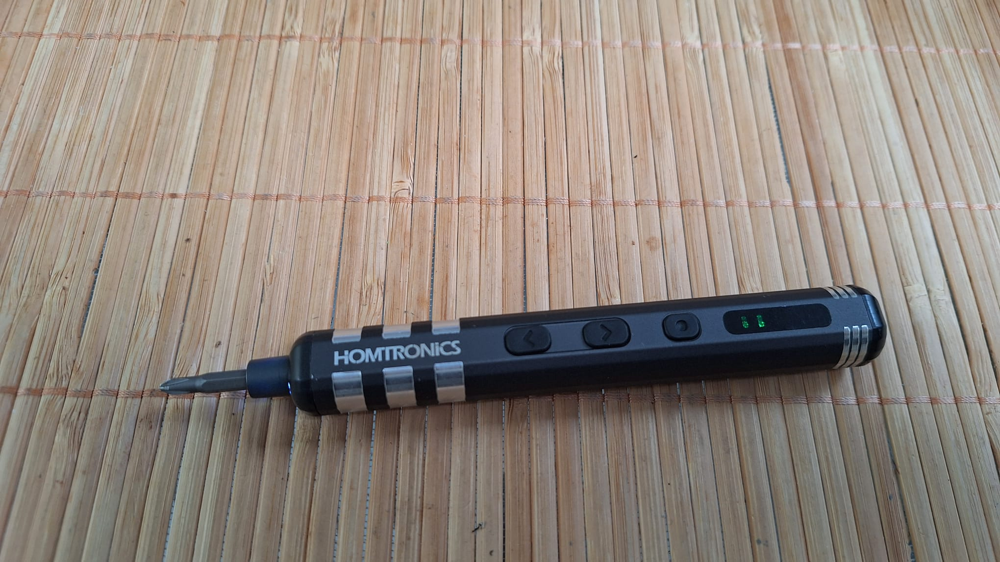
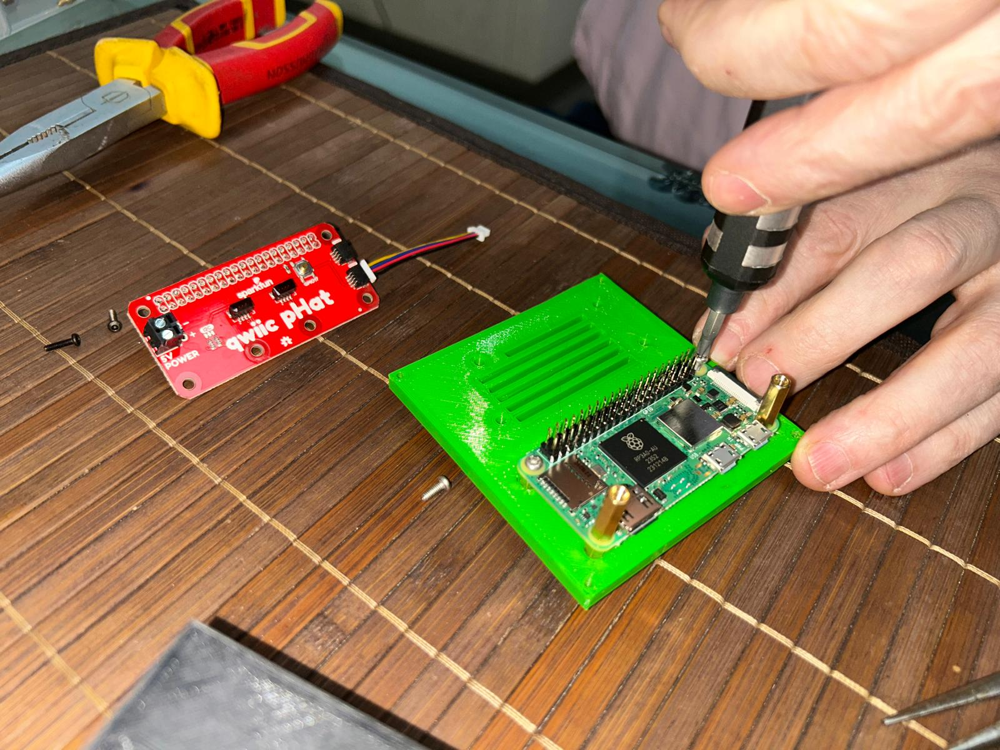
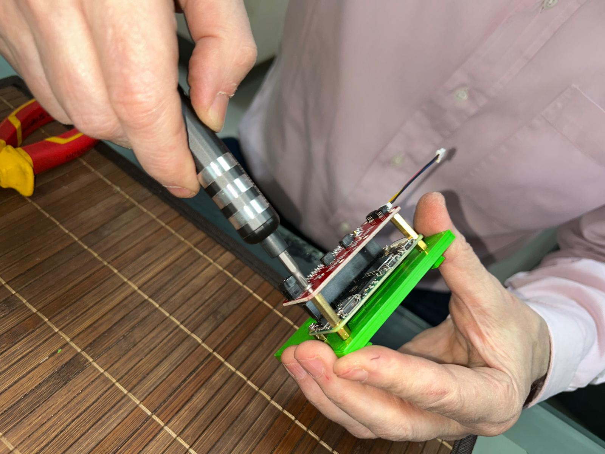
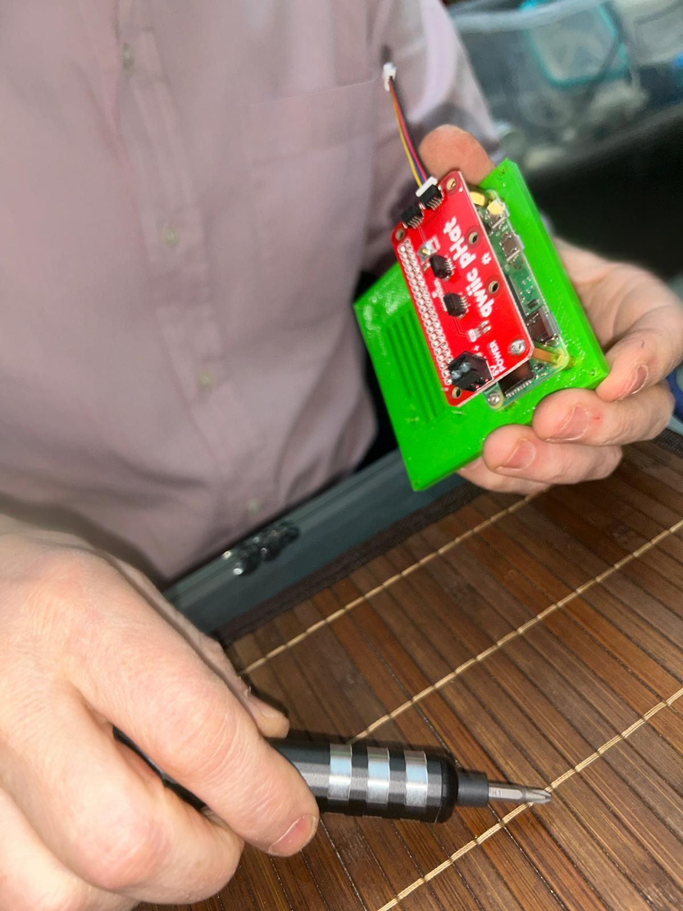
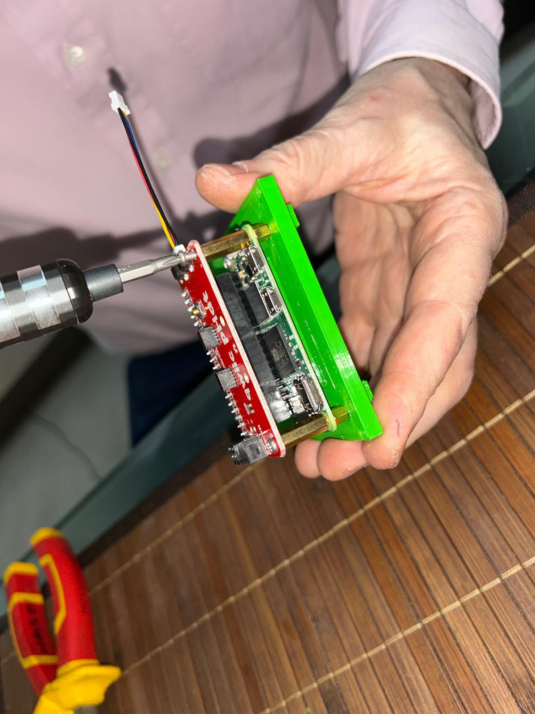
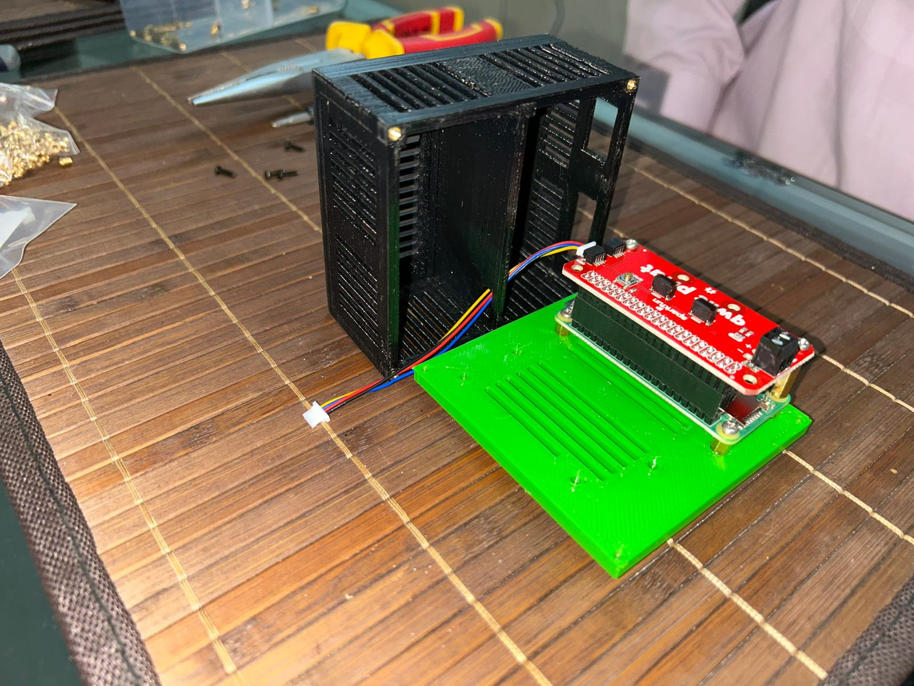
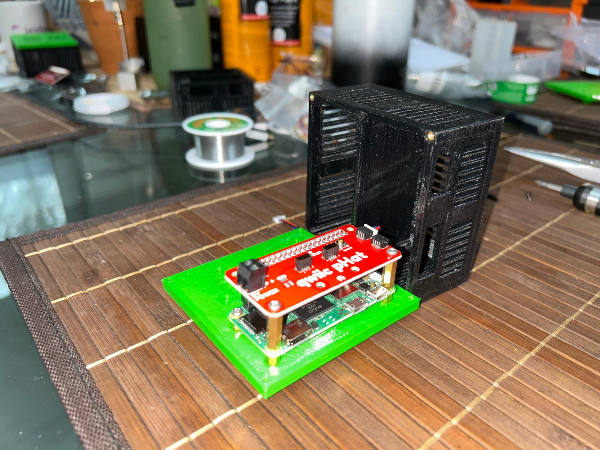
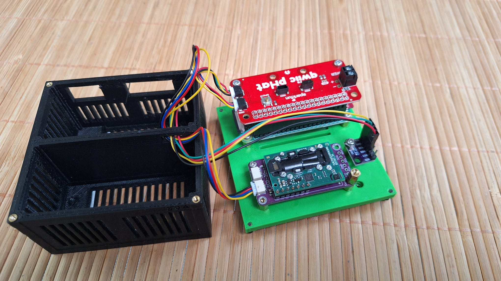
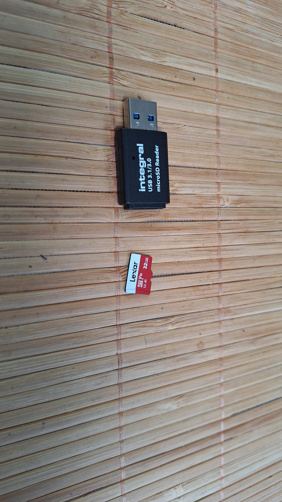

# Moon Rabbit CO2 Sensor Build Instructions

Here are the strep-by-step build instructions.

|                                                    |                                                                                                                                                                          |
| :----------------------------------------------------------------: | :----------------------------------------------------------------------------------------------------------------------------------------------------------------------: |
|    I use the HOMTRONICS electric screwdriver.  It's much easier.   |                                                                                                                                                                          |
|                                                    |                                                                                                                                                          |
|           Take the 3D printed Moon Rabbit case and stand           |                                                                        And four inserts and bolts                                                                        |
|                                                    |                                                                                                                                                          |
|        Use soldering iron to place insert into hole (part 1)       |                                                                      Place insert into hole (part 2)                                                                     |
|                                                    |                                                                                                                                                          |
|                   Place insert into hole (part 3)                  |                                                                      Place insert into hole (part 4)                                                                     |
|                                                    |                                                                                                                                                          |
|                   Place insert into hole (part 5)                  |                                                                    Finished article with four inserts                                                                    |
|                                                  |                                                                                                                                                        |
|   Test mount base and cover to maker sure that the holes line up.  | The Raspberry Pi Zero 2 W comes in two forms with and without GPIO headers. If you've bought it without headers (cheaper) then you need to solder the headers yourself). |
|                                                  |                                                                                                                                                        |
|                        Soldering headers (1)                       |                                                                           Soldering headers (2)                                                                          |
|                                                  |                                                                                                                                                        |
| Inserting the inserts plus 6mm standoffs with a soldering iron (1) |                                                    Inserting the inserts plus 6mm standoffs with a soldering iron (1)                                                    |
|                                                  |                                                                                                                                                        |
| Inserting the inserts plus 6mm standoffs with a soldering iron (3) |                                     Pi Zero mounted on the green base plate with headers and longer standoffs for mounting Qwiic pHAT                                    |
|                                                  |                                                                                                                                                        |
|          Assembled Pi Zero and Qwiic pHAT next to the case         |                                                                  Connecting the Qwiic pHAT ribbon cable                                                                  |
|                                                  |                                                                                                                                                        |
|            Securing the Qwiic pHAT to the Pi Zero stack            |                                                                Close-up of tightening the assembly screws                                                                |
|                                                  |                                                                                                                                                                          |
|           Final components laid out before final assembly          |                                                                                                                                                                          |
|                                                  |                                                                                                                                                        |
|            Partial assembly of the electronics and case            |                                                                Close-up of the Qwiic pHAT and sensor stack                                                               |
|                                                  |                                                                                                                                                                          |
|          Lexar 32GB microSD card and Integral card reader          |                                                                                                                                                                          |
